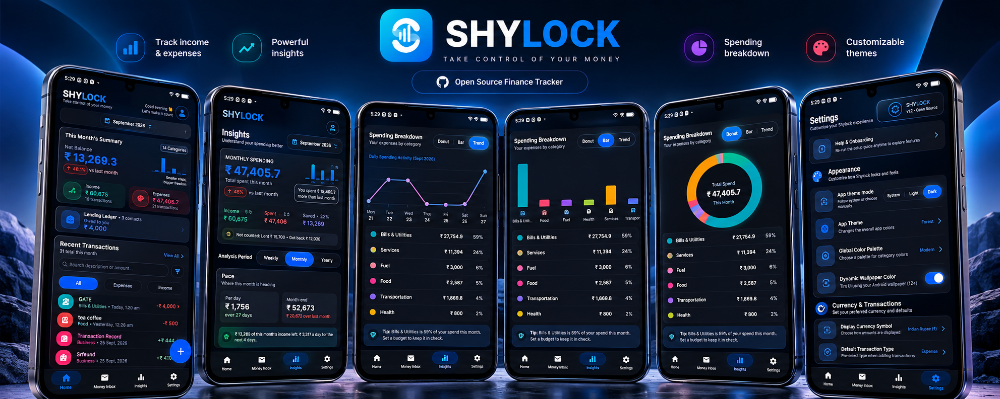
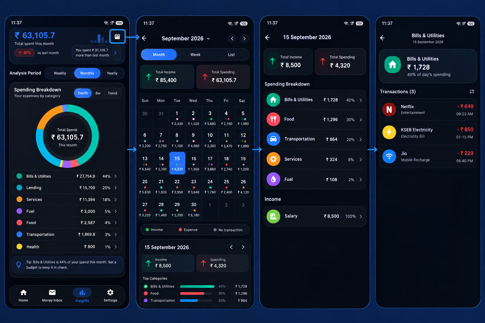
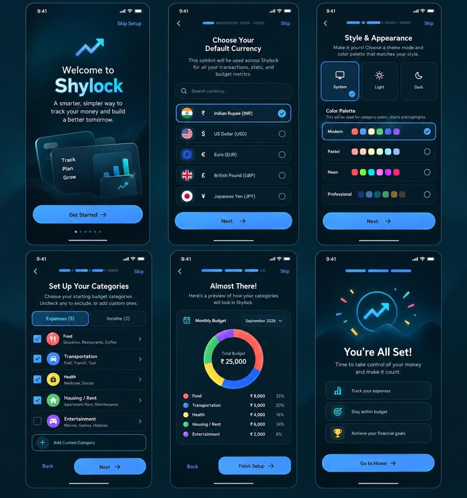

<div align="center">



# Shylock

**A private, offline expense tracker for Android that shows what you actually spent.**

Kotlin · Jetpack Compose · Room · Android 7.0+ (API 24)

</div>

---

## Why Shylock?

Most trackers add up every rupee that leaves your account. Suppose you lend a friend ₹10,000, they pay it back, and you spend that money. Most apps then report ₹20,000 of spending. Shylock separates **real spending** from money that only moves around:

| Money movement | How Shylock treats it |
| --- | --- |
| Purchases | Counted as spending |
| Salary, business income | Counted as income |
| **Refunds and cashback** | Subtracted from the category they came back to |
| **Money you lend / get back** | Kept in the Lending ledger, never counted as spending or income |
| **Transfers between your own accounts** | Left out of every total |

The result is one clear figure for each period: **Income − Spent = Saved**.

## Features

### 💸 Tracking
- **Income and expenses** in custom categories and subcategories, each with its own icon, colour and monthly budget.
- **"What is this?"** picker on every record: Expense, Income, Refund, Lent, Got back or Transfer.
- **Reclassify at any time.** Open an old record and mark it as Lent, and it moves into the Lending ledger.
- **Month navigation** with past months locked against accidental edits.

### 📥 Money Inbox
- Reads bank, UPI (GPay, PhonePe, Paytm and others) and SMS alerts through Android's notification access.
- Turns each alert into a **draft**. Nothing is recorded until you confirm it.
- **Suggests the right kind of record:**
  - refund wording suggests *Refund*;
  - a payment to or from someone in your Lending ledger suggests *Lent* or *Got back*.
- Optional payment alerts and a daily review reminder.

### 📊 Insights
- **Money flow:** income, real spending, amount saved and savings rate. A separate "not counted" line lists lending, refunds and transfers.
- **Pace:** spend per day, a month-end projection, and how much income is left per day for the rest of the month.
- **Spending breakdown** as a donut, bar or trend chart, by week, month or year.
- **Top & unusual:** biggest spends, where the money went (grouped by merchant or person), and categories running above your usual.
- **Spending calendar:** daily totals in month, week and list views. Drill down from a day to a category to individual records.

<div align="center">

</div>

### 🤝 Lending ledger
- Track what each person owes you, with a full history of money lent and repaid.
- Kept separate from your spending, with a running "still owed" total.

### 🎨 Personalisation
- A guided onboarding that sets your currency, theme and starting categories.
- Light, dark and system themes, several colour palettes, and Material You dynamic colour on Android 12+.

<div align="center">

</div>

### 🔒 Private by design
- All data stays on your device in a local Room database. There are no accounts, no cloud sync and no analytics.
- JSON **export and import** for backups.

## Getting started

### Requirements
- Android Studio (recent stable version)
- JDK 17 or newer
- An Android device or emulator running Android 7.0 (API 24) or later

### Build and run
```bash
git clone https://github.com/PRE53RVER/shylock.git
cd shylock
./gradlew assembleDebug
./gradlew installDebug   # with a device connected over USB debugging
```
You can also open the folder in Android Studio and press **Run**.

> **Debug signing:** the debug build is signed with `debug.keystore` in the project root. That file is git-ignored, so copy your own debug keystore there before building:
> `cp ~/.android/debug.keystore .`
>
> **Release builds** read the keystore from `KEYSTORE_PATH`, falling back to `my-upload-key.jks` in the root. They also need `STORE_PASSWORD` and `KEY_PASSWORD` set as environment variables.

### Enabling Money Inbox
1. Open **Money Inbox** in the app and turn on payment detection.
2. Allow **Notification access** for Shylock when Android asks.
3. Detected payments appear as drafts. Review each one and tap **Record**.

## Tests
```bash
./gradlew testDebugUnitTest
```
- Unit tests cover the money-flow maths, the notification parser, the calendar aggregation and month navigation.
- Robolectric tests target Android SDK 36, which **needs Java 21**. On JDK 17 those tests fail to start, but the rest of the suite runs normally.

## Project structure
```
app/src/main/java/com/example/
├── MainActivity.kt              # App shell, navigation, Home & Insights screens
├── data/
│   ├── db/AppDatabase.kt        # Room database, DAOs, migrations
│   ├── model/                   # Category, Transaction, Lending, DetectedPayment
│   │   └── MoneyFlow.kt         # Real-spend classifier used by every total
│   └── repository/              # Category, Lending and Money Inbox repositories
├── inbox/                       # Notification listener, parser, reminders
└── ui/
    ├── screens/                 # Insights cards, calendar, lending, categories, onboarding…
    ├── theme/                   # Colours, glass surfaces, typography
    └── viewmodel/               # CategoryViewModel (app state)
```

## Tech stack
- **Language and UI:** Kotlin 2.2, Jetpack Compose and Material 3
- **Storage:** Room for the local database
- **Background work:** Kotlin Coroutines and Flow
- **Navigation:** Navigation Compose
- **Build:** Gradle Kotlin DSL (AGP 9)
- **Testing:** JUnit and Robolectric

## Contributing
Issues and pull requests are welcome. Please run `./gradlew assembleDebug testDebugUnitTest` before opening a PR.
